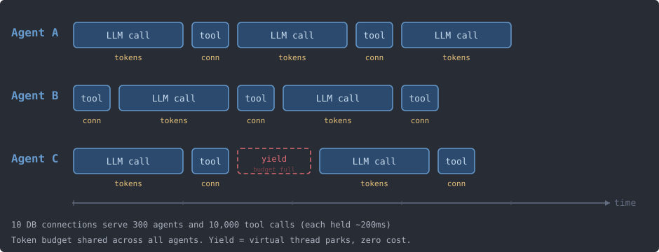

# Package: ai.redouble.nucleo.harness

Everything Nucleo runs, whether a model call, a tool call or an agent's whole reasoning loop,
runs here. This package is the runtime underneath the tools, agents and doers you write: it
gives each piece of work the connections and model capacity it asked for, runs it, times it
out, retries it when a provider fails, records what it did and hands back its result. This
page explains why agents need a runtime like this and how your code asks it for what it
needs.

## Why agents break ordinary resource management

A web request holds a database connection for about 50 milliseconds. An agent analyzing a
document makes 20 model calls of 30 seconds each, with database queries in between: ten
minutes from start to end. If it takes a connection when it starts and returns it when it
finishes, it holds that connection 12,000 times longer than the web request, and uses it
for about two seconds of the ten minutes. A hundred such agents need a hundred connections
held for ten minutes each.

```
Traditional web request:         AI agent:
|--50ms--|                       |------------- 10 minutes --------------|
  DB conn                         DB conn held the ENTIRE time
  held                            (actually used for ~2 seconds total)
```

Three things make agents different from requests:

- **They hold things for minutes.** Most of an agent's time is spent waiting for a model to
  answer, and whatever it holds while it waits is idle and unavailable to everyone else.
- **They arrive in bursts.** One agent fans out into twenty tool calls at once; a batch of
  documents starts a hundred agents at once.
- **A provider's quota caps them.** A model provider allows so many tokens and requests per
  minute. A request sent past that is refused with a 429, after the caller already took a
  connection and prepared the request.

Bigger pools and longer timeouts do not fix this: double the agents and every pool has to
double. The fix is structural: nothing should hold a resource while it waits for something
else.

## Everything is a job

In Nucleo every piece of work is a job: a Java object that says what it needs and then does
its work. A tool is a job, a single model call is a job, an agent's reasoning loop is a job,
and a pipeline is a job that submits more jobs. `JobDispatcher` runs them, each on its own
virtual thread, as [Your first tool](../../../../../../../../nucleo-examples/src/main/java/ai/redouble/examples/tool/PACKAGE.md)
showed.

A job never opens a connection itself. It declares what it needs in `getRequirements()`, the
dispatcher hands it all of that when it starts, and takes it back the moment it ends. So a
resource is held for exactly as long as the work that uses it runs:

```
Document Analysis Workflow (everything is a job):

Thinker: DocumentAnalyzer          (job - holds NO resources, runs 10 min)
  +-- LLM Call: "analyze these"    (job - holds LLM client for 30s)
  +-- Tool: SearchDatabase         (job - holds DB connection for 200ms)
  +-- LLM Call: "summarize this"   (job - holds LLM client for 25s)
  +-- Tool: SaveResults            (job - holds DB connection for 150ms)
  +-- LLM Call: "final answer"     (job - holds LLM client for 20s)
```

## Agents hold nothing

The jobs split into two kinds, introduced in
[Tools, thinkers and doers](../tools/PACKAGE.md). A **tool** does one operation and holds
what that operation needs, briefly. An **orchestrator**, which is a thinker (an agent whose
model picks the next step) or a doer (a composition in plain Java), holds nothing at all. It
submits tool calls and model calls as jobs of their own and waits for their results.

This is what makes a hundred agents cheap. An agent that runs for ten minutes costs one
virtual thread and some heap. The database connection its search tool needs is held for the
200 milliseconds of the search and then serves another agent's tool, so a small pool keeps
up with many agents.



The runtime enforces the split. An orchestrator declares no requirements and has no timeout
(its tools carry their own), and only an orchestrator may submit jobs from inside a job: a
tool that tries receives a failed handle telling it to coordinate through a doer or a
thinker.

## Declaring what a job needs

A tool states its needs in `getRequirements()`. Each call on `JobRequirements` asks for one
thing:

```java
private final JdbcResourceProvider orders = DBResourceProviders.get("orders", JdbcResourceProvider.class);

@Override
public JobRequirements getRequirements() {
    JobRequirements requirements = new JobRequirements();
    requirements.addProvider(orders);
    requirements.setRequiresTransaction(true);
    return requirements;
}
```

- **`addProvider`** asks for a database connection from a provider the application
  registered by name. Which kinds of provider exist, and what each hands the job, is on the
  pages for [JDBC](../jdbc/PACKAGE.md) and
  [Hibernate](../../../../../../../../nucleo-hibernate/src/main/java/ai/redouble/nucleo/hibernate/PACKAGE.md),
  and in [Admission](admission/PACKAGE.md) for the default provider that only counts.
- **`setRequiresTransaction(true)`** has Nucleo begin a transaction before `execute` and
  commit it after, or roll it back when `execute` throws.
- **`setReadOnly(true)`** tells the provider the job only reads, so it can hand out a
  read-only connection.
- **`setRequiresHttpConnection(true)`** asks for a place in the shared HTTP pool, for a tool
  that calls a web service ([HTTP from a tool](../http/PACKAGE.md)). A job that uses a model
  gets one without asking.
- **`requireRateLimiter`** asks for a slot on a limit of your own, such as a service that
  allows ten requests a second ([Admission](admission/PACKAGE.md) shows how to declare one).
- **`requireModel`** asks for a model by grade, and `requireEmbeddings` and
  `requireDecision` ask for the embeddings and decision models, which have no grades. The
  job names what it needs, never a concrete model, and the deployment's catalog decides
  which model serves it ([The catalog, grades and the picker](models/PACKAGE.md)):

```java
binding = requirements.requireModel(Grade.SMALL, Depth.STANDARD, 4000, OutputDeclaration.of(OutputSize.COMPACT));
```

  The binding the call returns is resolved to a model before the job starts, and
  `binding.getModel()` names it inside `execute`. The numbers are how many tokens the
  request sends and how long an answer it asks for, so the runtime can reserve them against
  the provider's quota.

A job that needs any of these also needs a timeout, and has one unless it removes it: every
job gets 30 minutes by default, and a job that declares resources and no timeout is refused
when it is submitted.

## Getting everything at once, or waiting with nothing

When the job's turn comes, the dispatcher first picks a model for each binding and prices
it in tokens, then checks it against any spend cap on the workflow, and then hands the job's
whole list of needs to admission. Admission gives the job all of it in one step: the tokens
on each model, the HTTP place, the database permits, your own limits. When any one of them
is short, the job waits holding none of them, and nothing it would have taken sits idle
while it waits. A job never holds the HTTP place while waiting for tokens, or a database
permit while waiting for the HTTP place.

This is also how the provider's quota is respected. The job's tokens are reserved before it
starts, so a request is sent only once it fits the model's budget. The usual alternative
spends before it checks:

```
Reactive (wasteful):                Pre-emptive (Nucleo):

1. Acquire DB connection            1. Check memory pressure (holding nothing)
2. Acquire HTTP connection          2. One grant: tokens + HTTP permit + DB permit,
3. Prepare request                     all at once, or park holding nothing
4. Call API                         3. Check out the DB connection under its permit
5. Get 429 rate limit!              4. Call API (inside the model's budget)
6. Hold DB + HTTP while waiting     5. Release everything
7. Retry...
   (DB + HTTP wasted during wait)
```

Memory counts too. No job can say how much heap it will use, so instead of a budget the
runtime watches the heap: at 95% it starts no more resource-holding jobs until the heap is
back under 90%. The jobs held back that way then start one at a time, 50 milliseconds apart
while the heap is under 80% and further apart the fuller it is and the faster it grew. A job
that arrives when nobody is waiting on memory starts at once. Orchestrators are never held
back, since they hold nothing.

[Admission](admission/PACKAGE.md) explains how the waiting line is ordered and which limits
exist, and [Why admission has this shape](admission/ADMISSION.md) says why it cannot be
simpler.

## Using what the job was given

`execute` receives `JobResources`, which holds what the job was admitted with:

```java
@Override
public OrderStatus execute(JobResources resources, JobContext<OrderStatus> context) throws LLMReadableCheckedException {
    Connection connection = resources.get(orders);
    ...
}
```

- `resources.get(provider)` returns the provider's object: a `java.sql.Connection` from the
  JDBC provider, a Hibernate `Session` from the Hibernate one. Asking for a provider the job
  did not declare throws `IllegalStateException`.
- `resources.getHttpClient()` returns the shared HTTP client.
- `resources.getLLMClient(model)`, `getEmbeddingsClient(model)` and `getDecisionClient(model)`
  return a client for the model a binding resolved to. Every call through them is recorded
  on the job.

When `execute` returns or throws, Nucleo commits or rolls back, closes the connections and
gives back every permit that returns with the work, before the job's result reaches whoever
is waiting for it. Tokens sent to a model stay spent: they come back as the provider's
window moves on. The tool never closes anything itself.

## A job never waits while holding

Admission never lets a job wait for resources while holding others. The same rule applies to
your code: a job that holds any resource and calls `get()` on a `JobHandle` receives a
`JobDeadlockException` naming both jobs and the line that waited. The runtime does not try
to work out whether the wait would really deadlock; waiting while holding is refused
outright.

When a job needs another job's result, it says so when it is submitted, and the runtime
waits for the result before it admits the job:

```java
JobHandle<Data> child = dispatcher.submit(new ChildJob(root));
JobHandle<Result> parent = dispatcher.submit(new ParentJob(root), child);
// Inside ParentJob.execute():
//   Data data = context.singleDependencyResult();  // already resolved, no blocking
```

By the time `ParentJob.execute` runs, the result is on its context, and nothing was held
while it was produced. `context.getDependencyResults()` returns all of them when there are
several. By default a failed dependency fails the job that depends on it before it runs; a
job that calls `setToleratesDependencyFailures(true)` on its requirements runs anyway and
finds the failures under `context.getDependencyErrors()`. `Governor` offers the same
submission calls as static methods.

## Committed data is visible to the next job

A job that commits and a job that depends on it raise a subtle problem: under load, a
database can accept a commit before other connections can see it, and the next job reads
stale data. So when Nucleo commits a job's transaction, `commitAll()` also waits until each
provider confirms the data is visible. For JDBC that is the commit itself, which returns
only once the server acknowledged it; the Hibernate provider waits on the transaction's
completion callback. The dependent job starts after that.

```
Without visibility guarantee:          With visibility guarantee:

Job A: [execute] [commit] [done]       Job A: [execute] [commit] [wait...] [visible] [done]
Job B:                    [start]                                           [start]
                          ^ reads                                           ^ reads
                          stale data!                                       committed data
```

## Timeouts that leave the database clean

Killing a thread can leave a transaction half-committed or a connection poisoned, so a
timeout ends a job in two steps. First the job is asked to stop: its cancellation flag is
set and its resources are closed, which makes whatever it was doing fail with a clean
exception. It then has a grace period, ten percent of its timeout but never under 500
milliseconds or over 30 seconds, to leave. A job that is still running after that is
interrupted, its database connections are aborted, which rolls back any transaction at the
protocol level, and everything it held is force-closed. The job ends timed out. Closing
twice is harmless, so the job's own cleanup and the timeout's never collide.

```
            timeout
               |
Job: [----executing----]
                       |
     Phase 1:          [cancel flag + close resources]
                       |           |
                       | grace     |
                       | period    |
     Phase 2:          |           [interrupt + abort connections + force close]
                       |
     Job cooperates:   [checks flag, exits cleanly]
     Job ignores:                  [killed, resources force-reclaimed]
```

A tool sets its own timeout with `setTimeout` in its constructor. Orchestrators have none.

## Cancelling a job

`JobHandle.cancel(reason)` cancels one job, and `JobDispatcher.cancelWorkflow` cancels every
job of a workflow. A job still waiting in a queue is removed and never runs. A running job is
told through its context and stops at its next `context.checkCancellation()`, which throws,
or when it sees `context.isCancelled()`. Cancellation is cooperative: a job that never checks
runs to its end, and its caller still receives the cancellation. Either way the caller's
`get()` throws an `ExecutionException` whose cause is a `JobCancelledException`.

## When a provider fails

When a model client reports that the provider rate-limited the call, was overloaded or
failed with a server error, the job does not fail. It gives back everything it holds, waits
a random delay that grows with each attempt, and runs again from the start: its needs are
declared again, the picker may choose another model in view of the failure, and it is
admitted again. It does this up to three times by default (`Job.getUpstreamRetries()`); a
job or its caller can set another number. [Retry signals](errors/retry/PACKAGE.md) lists the signals and what
each one does.

## Guardrails run on every call

The checks you attach to a tool, [guardrails](../guardrails/PACKAGE.md), run in the
dispatcher itself: the checks on the input after dependencies are resolved and before any
resource is taken, the checks on the output after the resources are given back and before
the result is delivered. Every route a call can take goes through the dispatcher, so a
guardrail protects the tool whoever called it. The scope an agent works within is checked at
the same door, when a job is submitted ([Scope and the trust boundary](../tools/guardrails/PACKAGE.md)).

## Work that wakes on a schedule

An agent that checks something every hour for months should hold nothing between its runs:
no parked thread, no state in memory. A heartbeat gives it that. An orchestrator publishes a
`ScheduleHeartbeat` naming a job class, an id and when to run, optionally with an input, a
conversation to continue and a `Recurrence.FixedInterval`, and the runtime submits that job
at that time as an ordinary submission, under the same scope as the orchestrator that
scheduled it:

```java
context.publish(new ScheduleHeartbeat(WatchJob.class, "watch-orders", null, Instant.now().plus(Duration.ofHours(1)), null, null));
```

An orchestrator can decide at the end of each run when it should wake next, so the pace
follows what it just saw; a fixed interval is the simple case. Application code outside any
job schedules through `JobDispatcher.scheduleHeartbeat(spec, userId)`. Schedules live in
memory: code that sets up fixed schedules publishes them again at every start, and a
deployment whose schedules must survive a restart plugs in a durable `HeartbeatStore`. The
events a schedule produces are on the [Heartbeats](../events/heartbeat/PACKAGE.md) page.

## Recording never slows a job

Every job publishes typed events as it runs: scheduled, started, progress, completed,
failed. Publishing never blocks. Each subscriber has its own queue served by its own virtual
thread, so a subscriber writing to a database never delays the job or any other subscriber.
Events are routed by type, workflow and job class, so an observer receives only what it
asked for, and an observer that reports itself stale is removed.

```
Job publishes event (non-blocking, returns immediately)
     |
     v
MessageBus routes by type + workflow + job class
     |
     +---> Subscriber A queue [virtual thread] --> a deployment's usage recorder (DB)
     |     (slow consumer doesn't block others)
     |
     +---> Subscriber B queue [virtual thread] --> WebSocket (UI)
     |
     +---> Subscriber C queue [virtual thread] --> OpenTelemetryObserver (traces)
     |
     +---> Subscriber D queue [virtual thread] --> MicrometerObserver (metrics)
```

[Events and the message bus](../events/PACKAGE.md) lists the events.

## One message for the model, another for people

When a tool fails, two readers need to hear about it: the model, so it can decide what to do
next, and possibly a person watching the work. They need different messages. The model
needs "Parameter 'query' with value '' failed validation: must not be blank"; the person
needs "Search failed - please try again". A type says which reader a message is for by
implementing `LLMReadable` (`getLLMMessage()`) or `HumanReadable` (`getHumanMessage()`), or
both. Exceptions implement `LLMReadable` to explain themselves to agents; events such as
`JobProgressEvent` implement `HumanReadable` to explain themselves to people.

```
InvalidInputException implements LLMReadable:
  getMessage():    "Parameter 'smiles' with value 'Q' failed: unrecognized atom"  (for logs)
  getLLMMessage(): "Invalid molecular structure - check SMILES syntax"             (for LLM)

JobProgressEvent implements HumanReadable:
  getHumanMessage(): "Analyzing document 3 of 10..."                              (for UI)
```

[Failures that behave](errors/EXCEPTIONS.md) covers the exceptions.

## Any database stack, any model client

Nucleo imports no data layer. A database stack plugs in through two interfaces:
`DBResourceProvider`, a thing that hands out connections or sessions, and
`DBManagedResource`, one of them held by one job. The default, `CountingDBResourceProvider`,
depends on no database API: it only counts how many jobs are using the database, and the job
takes its connections from the application's own stack. The Spring Boot starter and the
Quarkus integration register it from `nucleo.database.*`. Three providers that hold the
connection for the job ship beside it. None of them touches the pool behind it: the pool is
the application's, whichever it is.

```
Any stack          ---built-in--> CountingDBResourceProvider        --> your pool (a count)
JDBC DataSource    ---built-in--> JdbcResourceProvider              --> your pool
Hibernate factory  ---companion-> HibernateResourceProvider         --> your pool
Spring TX manager  ---starter----> SpringTransactionResourceProvider --> your pool
```

The JDBC provider is in `ai.redouble.nucleo.jdbc`, the Hibernate provider in the
`nucleo-hibernate` module, and the Spring provider, over the application's own transaction
manager, in the [Spring Boot](../../../../../../../../nucleo-spring-boot-starter/src/main/java/ai/redouble/nucleo/spring/PACKAGE.md)
starter. Model clients plug in the same way, one `ClientProvider` per vendor or endpoint,
found on the classpath ([Model clients and rate limits](llm/PACKAGE.md)).

## Built on virtual threads

Every job runs on its own virtual thread, and so do the queues, the admission evaluator, the
heartbeat scheduler and every event subscriber. A virtual thread makes blocking cheap, so the
runtime is written as plain synchronous Java: a job blocks on `handle.get()`, a job waiting
for admission parks until its needs fit, and admission's own thread parks until something
changes or a computed moment arrives. There are no callback chains, reactive streams or
`CompletableFuture` pipelines to follow, it is easy to debug, and it runs thousands of jobs
at once with no thread pool to tune.

> **Example:** [Hello, model](../../../../../../../../nucleo-examples/src/main/java/ai/redouble/examples/hello/PACKAGE.md)
> starts the dispatcher, submits one job and drains it; [Your first doer](../../../../../../../../nucleo-examples/src/main/java/ai/redouble/examples/doer/PACKAGE.md)
> fans jobs out and in on virtual threads.

## How it works inside

How the job tree records call order, how the dispatcher assembles and admits a demand, the
memory gate's pacing, the account contract behind every limit, the scope door and the
heartbeat's authority, and the dispatch contract rule by rule with the tests that hold it,
are in [Inside the job runtime](HARNESS_INTERNALS.md), for those working on the runtime
itself.
